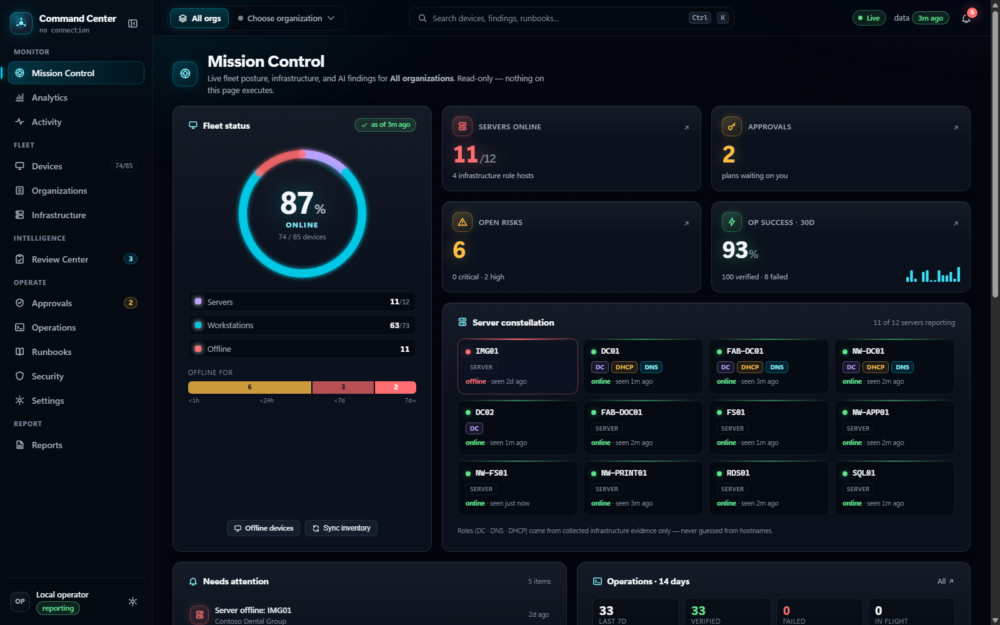
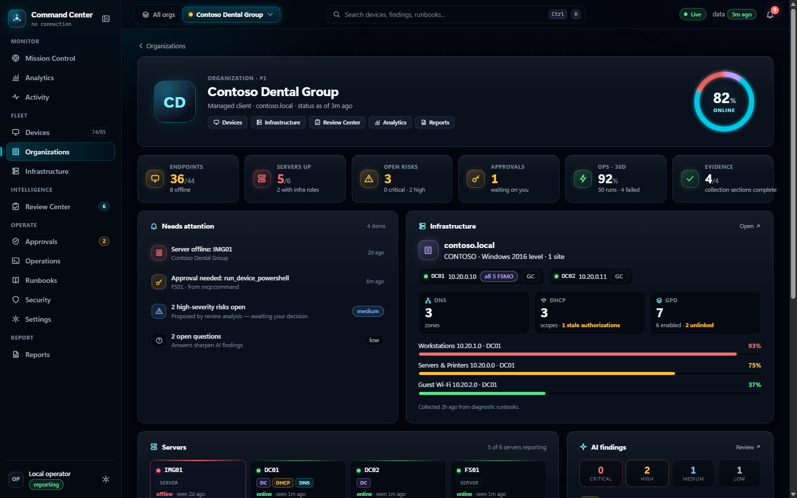
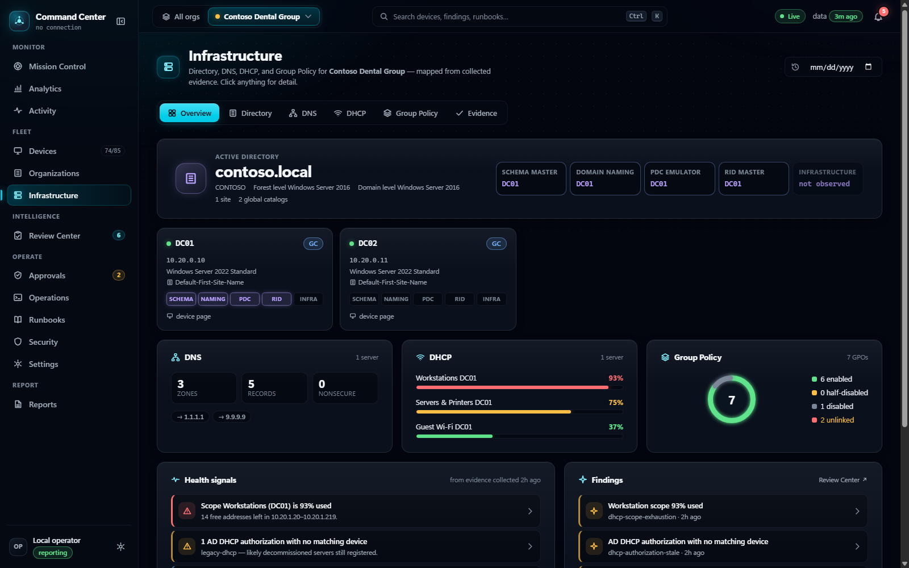
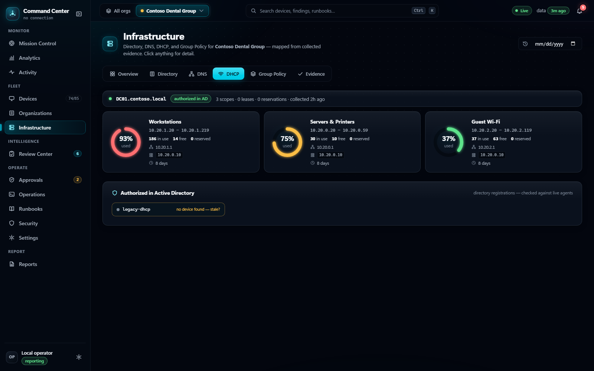
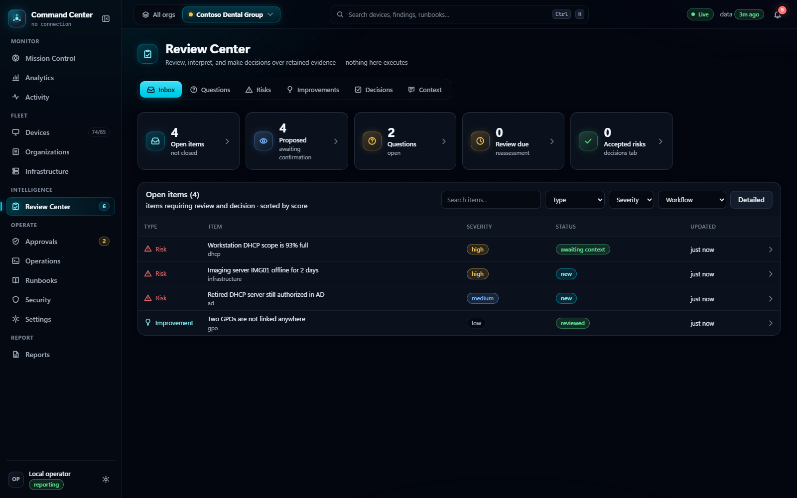
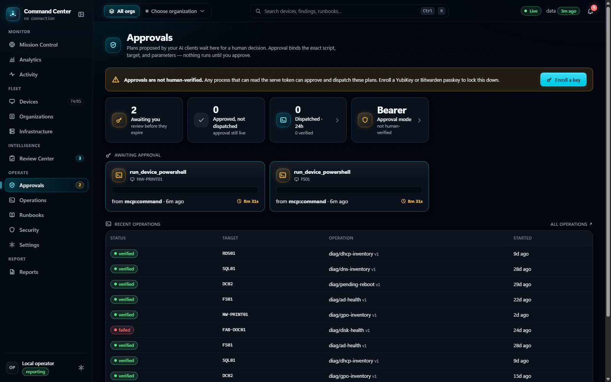
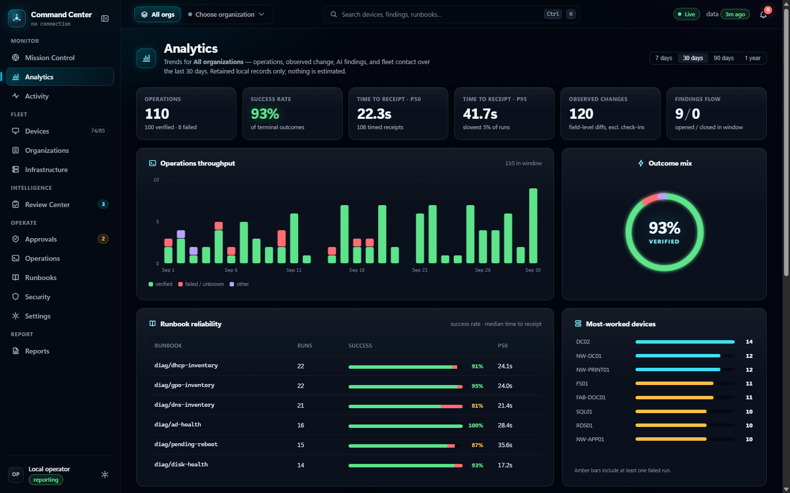
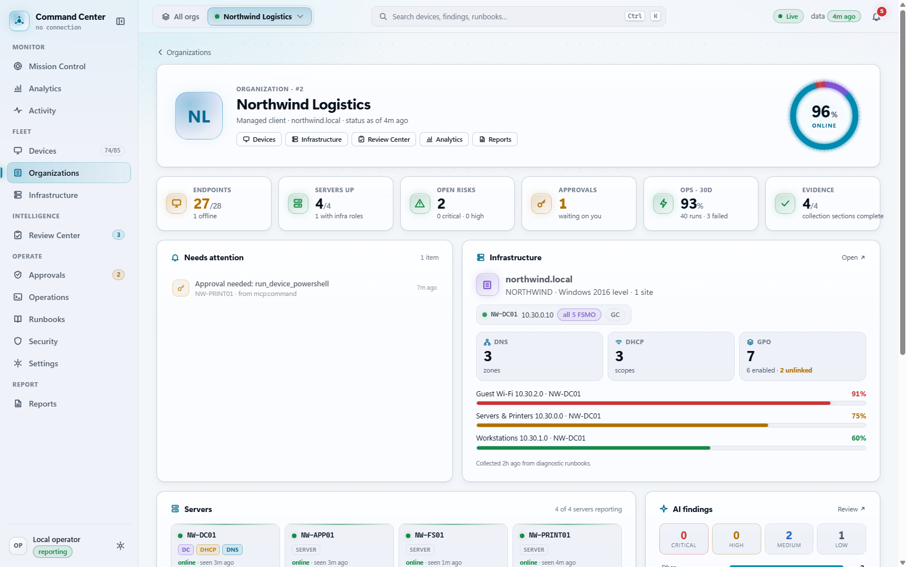
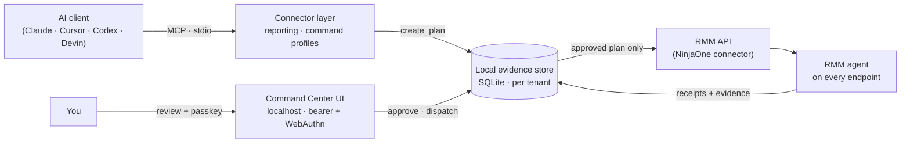

<div align="center">

# Mission Control

**Run IT for many organizations in natural language — with a human hand on every change.**

A local command center that lets your AI assistant (Claude, Cursor, Codex, Devin, any MCP client) investigate and operate your RMM fleet — while every endpoint action waits for **your** approval, signed with a passkey.

[](https://github.com/Solve4x-ai/Mission-Control/actions/workflows/ci.yml)


[](LICENSE)

[Try the demo](#try-it-in-60-seconds) · [Setup](SETUP.md) · [Features](FEATURES.md) · [Tools](TOOLS.md) · [Connect an AI client](docs/harness-guide.md) · [Security model](docs/security-model.md)



</div>

## Why

MSPs and IT teams already have an agent on every machine. What they don't have is a safe way to let an AI *use* it. Mission Control is that missing layer:

- **Talk to your fleet.** "Which DHCP scopes are almost full?" "Why is the reception PC offline?" "Inventory the GPOs on the domain and flag anything unlinked." The assistant answers from collected evidence — not guesses.
- **Nothing runs without you.** Every endpoint action is an immutable, hashed plan that waits for a human. With a YubiKey, Windows Hello, or Bitwarden passkey enrolled, an AI holding every token on the box still cannot approve anything.
- **Everything is remembered.** Findings, questions, answers, decisions, and receipts are durable. The next session — or the next AI — picks up where the last one left off.
- **One pane per client, or all of them.** A global organization scope follows you across every page.
- **Local by design.** No cloud service, no telemetry. Your RMM credentials never leave your machine.

## Try it in 60 seconds

No RMM account needed. The demo runs the full UI against a fictional MSP with three clients and ~85 devices, sandboxed and read-only:

```bash
git clone https://github.com/Solve4x-ai/Mission-Control.git
cd Mission-Control
npm install
npm run demo
```

Your browser opens at `http://localhost:39399`. Press `Ctrl+C` to stop; `npm run demo -- --reset` regenerates the data.

## Screenshots

| | |
|---|---|
|  **Organizations** — every client as a command page: KPIs, infrastructure snapshot, servers, risks, and what needs attention. |  **Infrastructure** — Active Directory with FSMO roles, DNS, DHCP, and Group Policy health, derived only from collected evidence. |
|  **DHCP** — scope utilization gauges, options, and stale AD authorizations checked against live agents. |  **Review Center** — AI- and rule-proposed risks with provenance; your decisions are recorded, never rewritten. |
|  **Approvals** — plans your AI proposed wait here. Approval binds the exact script, target, and parameters. |  **Analytics** — runbook reliability, p50 / p95 time-to-receipt, change volume, and findings flow. |

<div align="center"><br><sub>Dark, light, and system themes · four accents · compact or comfortable density · <code>Ctrl+K</code> command palette</sub></div>

## How it works



1. **Collect** — read-only diagnostic runbooks (AD health, DNS, DHCP, GPO, …) run through an approved PowerShell runner. Results land as timestamped observations with explicit coverage, so "not found" is only claimed where a complete enumeration ran.
2. **Understand** — deterministic rules raise findings; the AI adds context, questions, and recommendations in the Review Center.
3. **Propose** — endpoint work becomes a plan: exact script, targets, parameters, and a hash that binds them.
4. **Approve** — you approve in the local UI. Approvals expire, are single-use, bind to the plan hash, and require a passkey once one is enrolled.
5. **Execute & verify** — dispatch is idempotent, canary batches gate the rest of the fleet, and "accepted" never means "done" until a receipt proves it.

## Safety model

| Layer | Guarantee |
|---|---|
| **Two profiles** | A read-only *reporting* identity and a separately authorized *command* identity (OAuth + PKCE). They share no credentials. |
| **Plan-only execution** | Endpoint-affecting tools (scripts, reboot, service control, …) are refused outright — `confirm: true` is not approval. |
| **Human-presence approval** | WebAuthn passkeys. The first key bootstraps; every later key or revocation needs an existing key; the last key can't be removed. |
| **Organization boundaries** | Explicit allowlists, re-checked against a fresh device lookup immediately before dispatch. |
| **Bounded sessions** | Follow-up commands on an approved device are capped by TTL and count — or disabled entirely. |
| **Audit** | Every tool call is journaled with redacted arguments; every approval stores its signed assertion. |
| **Local** | stdio MCP only; the UI binds to loopback. No hosted service, no credentials in client config. |

Details: [docs/security-model.md](docs/security-model.md).

## Use it with your NinjaOne tenant

Requirements: **Windows**, **Node.js 22.13+**, and two NinjaOne API applications (an API Services app for read-only reporting and a Native app for commands). The UI and MCP server are cross-platform Node, but the endpoint runbooks and setup scripts are PowerShell-first.

```powershell
git clone https://github.com/Solve4x-ai/Mission-Control.git
cd Mission-Control
npm install
npm run build
Copy-Item config\reporting.env.example config\reporting.env
Copy-Item config\command.env.example   config\command.env
Copy-Item config\policy.example.json   config\policy.json
```

Then follow **[SETUP.md](SETUP.md)** — about 15 minutes — to create the NinjaOne apps, authorize the command profile, start the Command Center, enroll a passkey, and connect your AI client from **Settings → MCP clients**.

The tracked policy example disables every write. Enable only what you need, per organization.

## Development

```powershell
npm run build     # TypeScript → dist/
npm test          # mocked tests — never touch a live tenant
npm run verify    # build + tests + PowerShell runner tests
```

The UI is vanilla ES modules and CSS (oklch design tokens, View Transitions, container queries) — no framework and no build step. See [CONTRIBUTING.md](CONTRIBUTING.md).

## Roadmap

Additional RMM connectors (the core is connector-agnostic) · SNMPv3 network-edge agent for switches, firewalls, APs, and printers · reboot / service / patch actions as approved runbooks · scheduled management reports · notifications · OS-account separation for the command server. Details in [FEATURES.md](FEATURES.md#roadmap-planned-not-yet-built).

## License

[MIT](LICENSE). Originally derived from [NinjaOneMCP](https://github.com/Lungshot/NinjaOneMCP). The NinjaOne connector is built on the NinjaOne public API; this project is not affiliated with or endorsed by NinjaOne.
