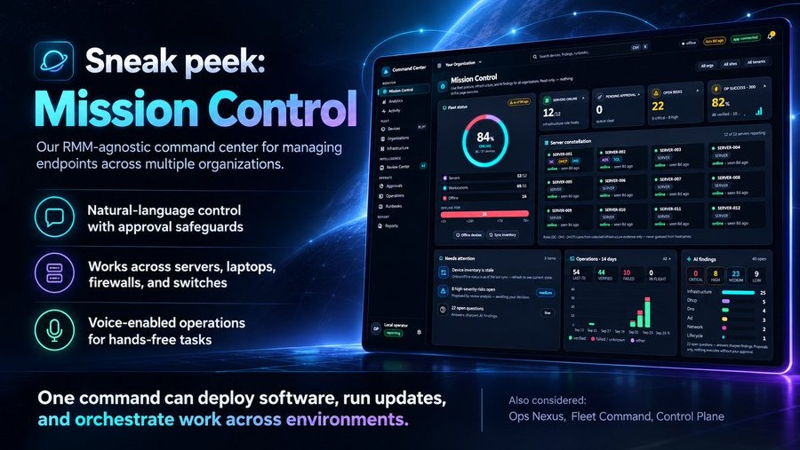
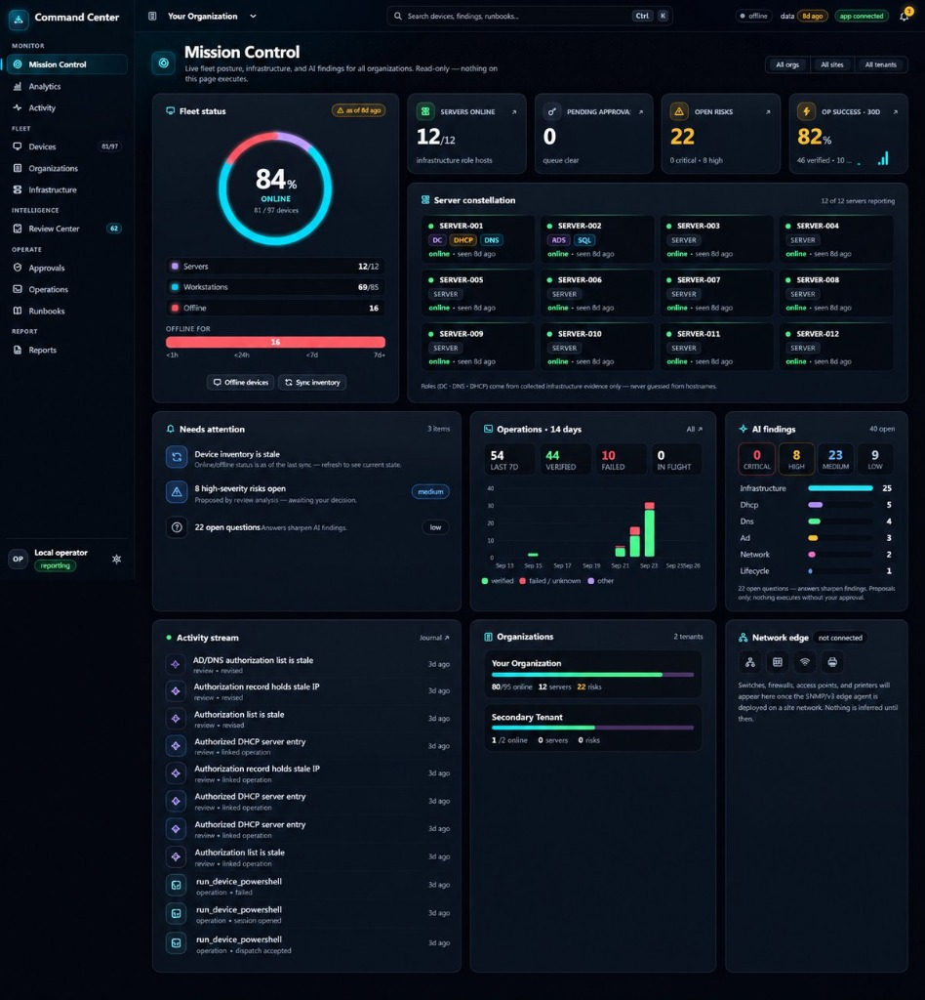
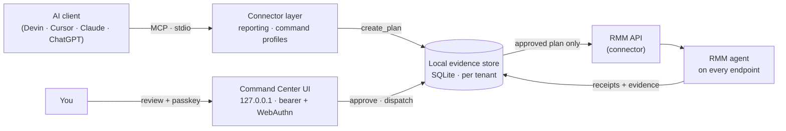

<div align="center">



# Mission Control

**Run IT for many organizations in natural language — with a human hand on every change.**

An RMM-agnostic command center: a local operations hub + MCP connector layer that turns the agent already living on every endpoint into a safe, auditable execution fabric for AI assistants (Devin, Cursor, Claude, ChatGPT, any MCP client). The AI investigates, explains, and proposes. **You** approve — with a hardware key.

**First connector: NinjaOne.** The core — plans, approvals, evidence, review, receipts — is deliberately connector-agnostic; additional RMM connectors are on the roadmap.


[Features](FEATURES.md) · [Setup](SETUP.md) · [Tools](TOOLS.md) · [Harness guide](docs/harness-guide.md) · [Security model](docs/solve4x-security-profiles.md) · [Changelog](CHANGELOG.md)

</div>

---

## Why

MSPs and IT teams already have an agent on every machine. What they don't have is a way to let an AI *use* it without handing over the keys. Mission Control is that missing layer:

- **Talk to your fleet.** "Which DHCP scopes are almost full?" "Why is Front Desk PC offline?" "Inventory the GPOs on the domain and flag anything unlinked." The assistant answers from real, collected evidence — not guesses.
- **Nothing runs without you.** Every endpoint action is an immutable, hashed plan that waits for a human. With a YubiKey or Bitwarden passkey enrolled, an AI holding every token on the box still cannot approve anything.
- **Everything is remembered.** Findings, questions, answers, decisions, and receipts are durable. The next session — or the next AI — picks up where the last one left off.
- **One pane per tenant, or all of them.** A global organization scope follows you across every page.

<div align="center">

</div>

## What it looks like

| | |
|---|---|
| **Mission Control** | Live fleet ring, server constellation with evidence-backed DC / DNS / DHCP roles, a ranked attention queue, operations trend, AI findings, and an activity stream. |
| **Organizations** | Every tenant as a health card; each opens a full command page — KPIs, infrastructure snapshot, servers, risks, offline devices, activity. |
| **Infrastructure** | Active Directory map with FSMO roles, DNS zone grid, DHCP scope gauges, Group Policy health, and a coverage matrix — health signals derived only from collected evidence. |
| **Review Center** | AI-proposed risks, improvements, and questions with provenance; your decisions are recorded with rationale and never rewritten. |
| **Approvals** | The exact script, line-numbered, with impact and session disclosure — approved with a passkey tap. |
| **Analytics** | Operation reliability per runbook, p50 / p95 time-to-receipt, change volume, findings flow, fleet check-in health. |

Dark, light, and system themes · four accents · compact or comfortable density · `Ctrl+K` command palette · one organization scope across every page.

## How it works



1. **Collect** — read-only diagnostic runbooks (AD health, DNS, DHCP, GPO, …) run through an approved PowerShell runner. Results land as immutable, timestamped observations with explicit coverage (complete / partial / failed), so "not found" is only claimed where a complete enumeration ran.
2. **Understand** — deterministic rules raise findings; the AI adds context, questions, and recommendations to the Review Center. Nothing is inferred beyond what was observed.
3. **Propose** — endpoint work becomes a plan: exact script, target set, parameters, and a hash that binds them.
4. **Approve** — a human approves on the local UI. Approvals expire, are single-use, bind to the plan hash, and (once a key is enrolled) require a WebAuthn assertion with user verification.
5. **Execute & verify** — dispatch is idempotent, canary batches gate the rest of a fleet, and "accepted" never means "done" until a receipt proves it.

## Safety model

| Layer | Guarantee |
|---|---|
| **Two profiles** | A read-only *reporting* identity and a separately authenticated *command* identity (OAuth + PKCE). They share no credentials. |
| **Plan-only execution** | Endpoint-affecting MCP tools (`run_device_script`, reboot, service control, patching, …) are refused outright — `confirm: true` is not approval. |
| **Human-presence approval** | YubiKey / Bitwarden passkeys. The first key bootstraps; every later key or revocation needs an existing key; the last key can't be removed. |
| **Organization boundaries** | Explicit allowlists, checked again against a fresh device lookup immediately before dispatch. |
| **Bounded sessions** | Follow-up commands on an approved device are capped by TTL and count — or disabled entirely. |
| **Audit** | Every tool call is journaled with redacted arguments; every approval stores its signed assertion. |
| **Local by design** | stdio MCP only; the UI binds to loopback. No hosted service, no credentials in client config. |

## Quick start

Requirements: Windows, Node.js 22.13+ (built-in `node:sqlite`), and — for the NinjaOne connector — two NinjaOne applications (Monitoring-scope API client for reporting; Native app with Monitoring + Management for command).

```powershell
git clone https://github.com/Solve4x-ai/Mission-Control.git
cd Mission-Control
npm install
Copy-Item config\reporting.env.example config\reporting.env
Copy-Item config\command.env.example   config\command.env
Copy-Item config\policy.example.json   config\policy.json
npm run verify
```

Fill the ignored `config/*.env` files locally, add the entries from [`mcp-config.json.example`](mcp-config.json.example) to your MCP client, then start the command center:

```powershell
$env:DOTENV_CONFIG_PATH = 'config/command.env'
$env:NINJA_SERVE_PORT = '39300'
$env:NINJA_SYNC_INTERVAL_MINUTES = '5'   # live inventory; connector API reads only, no AI tokens
node --require dotenv/config dist/serve.js
```

Open **http://localhost:39300** (localhost, not 127.0.0.1 — browsers only allow passkeys there), paste the token from `%USERPROFILE%\.ninjaone-mcp\serve.token`, and enroll a key under **Security**.

Full authorization and Windows ACL guidance: [SETUP.md](SETUP.md).

## Safe defaults

The tracked policy example disables every write. Enable only what you need, per organization, in the ignored `config/policy.json`. Never put secrets, authorization codes, or tokens in chat, source control, MCP client JSON, tickets, or logs.

## Development

```powershell
npm run build     # TypeScript → dist/
npm test          # 171 mocked tests — never touch a live tenant
npm run verify    # build + tests
npm audit
```

The UI is vanilla ES modules and CSS (oklch design tokens, View Transitions, container queries) — no framework and no build step. See [docs/m4.6-design-system.md](docs/m4.6-design-system.md).

## Roadmap

Additional RMM connectors (the core is connector-agnostic by design) · SNMPv3 network-edge agent (switches, firewalls, APs, printers) · reboot / service / patch actions as approved runbooks · scheduled management reports · notifications · OS-account separation for the command server. Details in [FEATURES.md](FEATURES.md#roadmap-planned-not-yet-built).

## License

[MIT](LICENSE) — originally derived from the NinjaOneMCP project. The NinjaOne connector is built on the NinjaOne public API; this project is not affiliated with or endorsed by NinjaOne.
